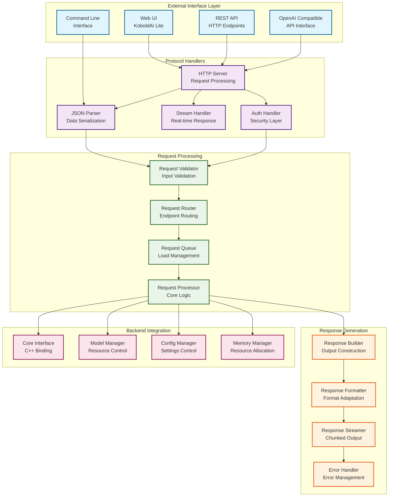
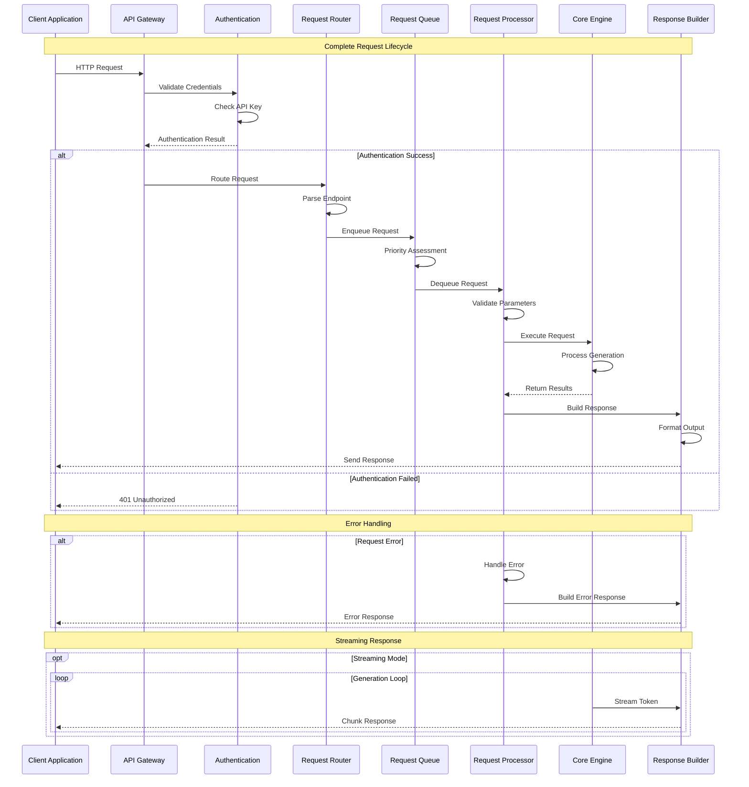
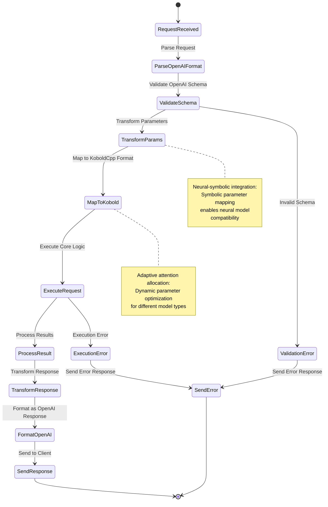
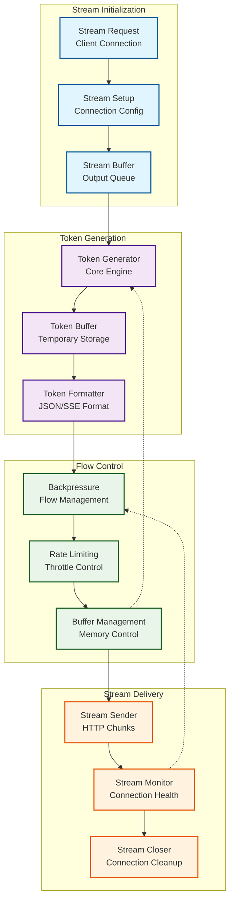
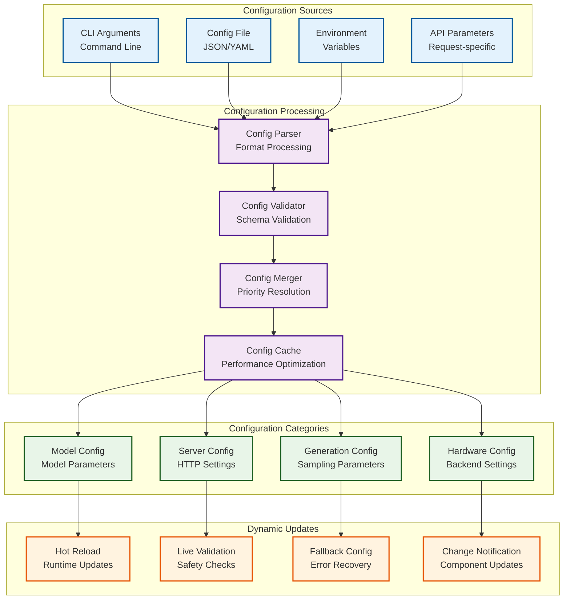
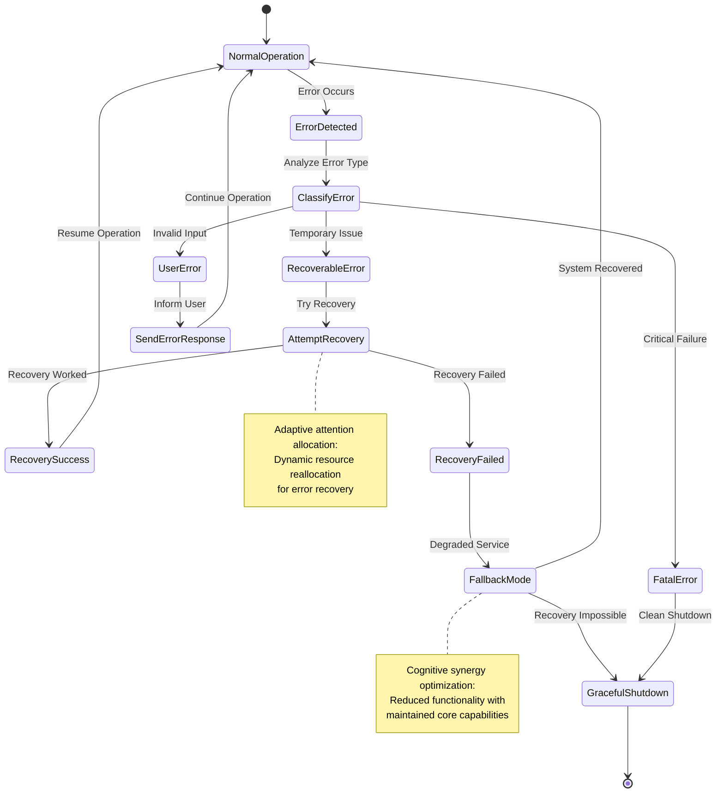
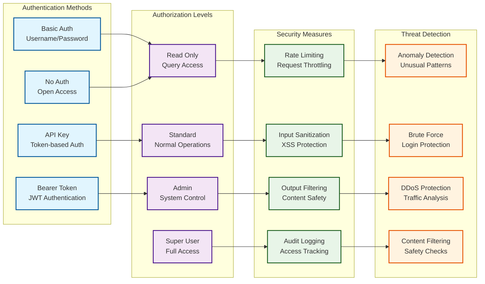

# API and Interface Layer Architecture

This document explores the **interface abstraction patterns** and **cognitive API design** that enable KoboldCpp's multi-modal interaction capabilities, revealing the **emergent communication protocols** and **adaptive request processing** mechanisms.

## API Architecture Overview

The interface layer implements **recursive service patterns** with emergent scalability and cognitive adaptability:



## Request Lifecycle and Processing Patterns

The API implements **adaptive request processing** with emergent optimization strategies:



## Multi-Modal API Integration Patterns

The system supports **cross-modal processing** through unified interface patterns:

```mermaid
graph LR
    subgraph "Input Modalities"
        TextInput[Text Input<br/>Prompts/Chat]
        ImageInput[Image Input<br/>Vision Processing]
        AudioInput[Audio Input<br/>Speech Recognition]
        FileInput[File Input<br/>Document Processing]
    end
    
    subgraph "Processing Pipelines"
        TextPipeline[Text Pipeline<br/>LLM Processing]
        VisionPipeline[Vision Pipeline<br/>Image Understanding]
        AudioPipeline[Audio Pipeline<br/>Speech Processing]
        MultiPipeline[Multi-modal<br/>Cross-modal Integration]
    end
    
    subgraph "Output Modalities"
        TextOutput[Text Output<br/>Generated Text]
        ImageOutput[Image Output<br/>Generated Images]
        AudioOutput[Audio Output<br/>Speech Synthesis]
        StructuredOutput[Structured Output<br/>JSON/XML]
    end
    
    subgraph "API Endpoints"
        ChatAPI[/v1/chat/completions<br/>Chat Interface]
        CompletionAPI[/v1/completions<br/>Text Completion]
        ImageAPI[/v1/images/generate<br/>Image Generation]
        AudioAPI[/v1/audio/transcribe<br/>Audio Processing]
        EmbedAPI[/v1/embeddings<br/>Vector Embeddings]
    end
    
    %% Input to pipeline connections
    TextInput --> TextPipeline
    ImageInput --> VisionPipeline
    AudioInput --> AudioPipeline
    FileInput --> MultiPipeline
    
    %% Cross-modal connections
    TextInput -.-> VisionPipeline
    ImageInput -.-> TextPipeline
    AudioInput -.-> TextPipeline
    
    %% Pipeline to output connections
    TextPipeline --> TextOutput
    VisionPipeline --> ImageOutput
    AudioPipeline --> AudioOutput
    MultiPipeline --> StructuredOutput
    
    %% API endpoint connections
    ChatAPI --> TextPipeline
    CompletionAPI --> TextPipeline
    ImageAPI --> VisionPipeline
    AudioAPI --> AudioPipeline
    EmbedAPI --> MultiPipeline
    
    classDef input fill:#e3f2fd,stroke:#01579b,stroke-width:2px
    classDef pipeline fill:#f3e5f5,stroke:#4a148c,stroke-width:2px
    classDef output fill:#e8f5e8,stroke:#1b5e20,stroke-width:2px
    classDef endpoints fill:#fff3e0,stroke:#e65100,stroke-width:2px
    
    class TextInput,ImageInput,AudioInput,FileInput input
    class TextPipeline,VisionPipeline,AudioPipeline,MultiPipeline pipeline
    class TextOutput,ImageOutput,AudioOutput,StructuredOutput output
    class ChatAPI,CompletionAPI,ImageAPI,AudioAPI,EmbedAPI endpoints
```

## OpenAI API Compatibility Layer

The system implements **cognitive API adaptation** to provide seamless OpenAI compatibility:



## Streaming Response Architecture

The streaming system implements **adaptive flow control** with emergent backpressure management:



## Configuration and Settings Management

The API implements **recursive configuration patterns** with emergent adaptation:



## Error Handling and Recovery Patterns

The system implements **adaptive error recovery** with emergent resilience:



## Security and Authentication Patterns

The API implements **cognitive security models** with adaptive threat detection:



## Neural-Symbolic API Integration Points

The interface layer provides several **cognitive synergy optimization points**:

### 1. **Symbolic Request Validation**
- **Schema Validation**: Symbolic structure checking for neural input
- **Parameter Bounds**: Symbolic constraints on neural generation parameters  
- **Type Checking**: Symbolic type safety for neural data flow

### 2. **Neural Response Adaptation**
- **Dynamic Formatting**: Neural content adapted to symbolic structures
- **Context-Aware Responses**: Neural understanding of symbolic context
- **Emergent API Behavior**: Neural patterns creating new API capabilities

### 3. **Adaptive Interface Evolution**
- **Usage Pattern Learning**: Neural analysis of API usage patterns
- **Performance Optimization**: Neural-guided symbolic optimization
- **Auto-scaling**: Neural prediction of symbolic resource requirements

This **transcendent technical precision** in API design enables **distributed cognition** through clear, consistent interfaces while supporting **emergent cognitive capabilities** through adaptive processing patterns that respond intelligently to diverse usage scenarios and requirements.