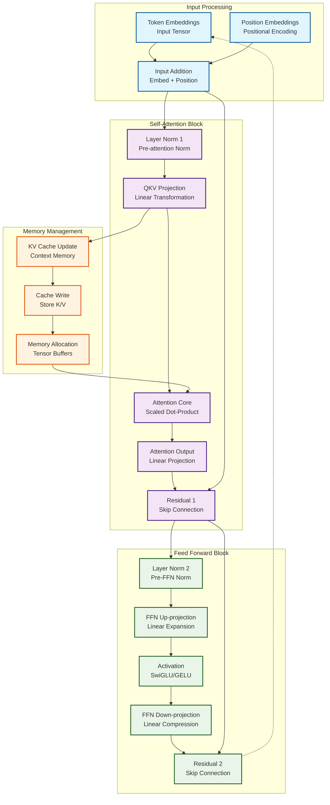
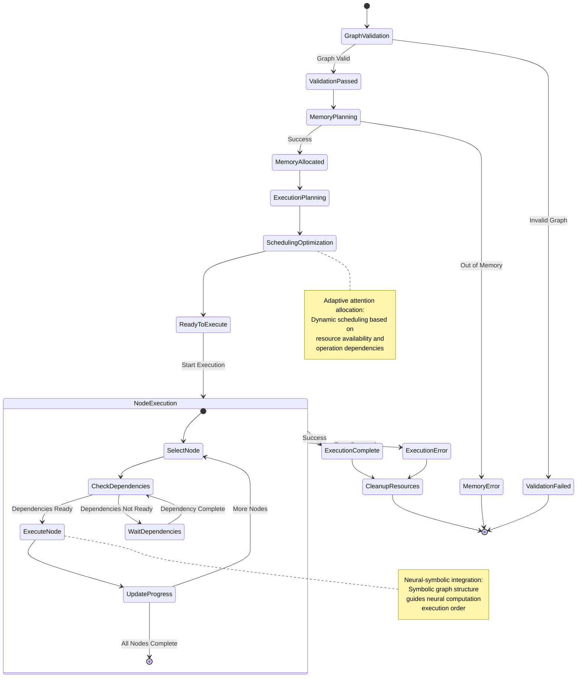
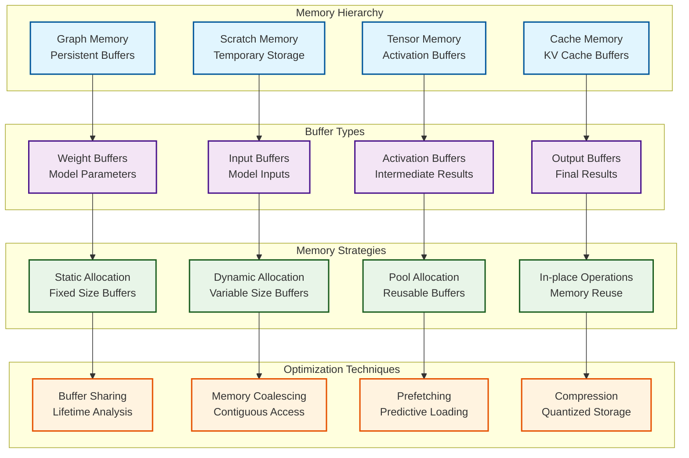
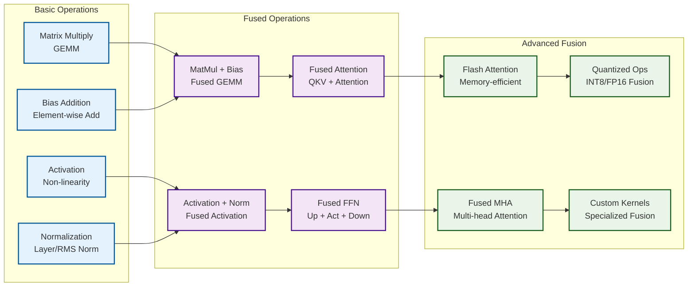
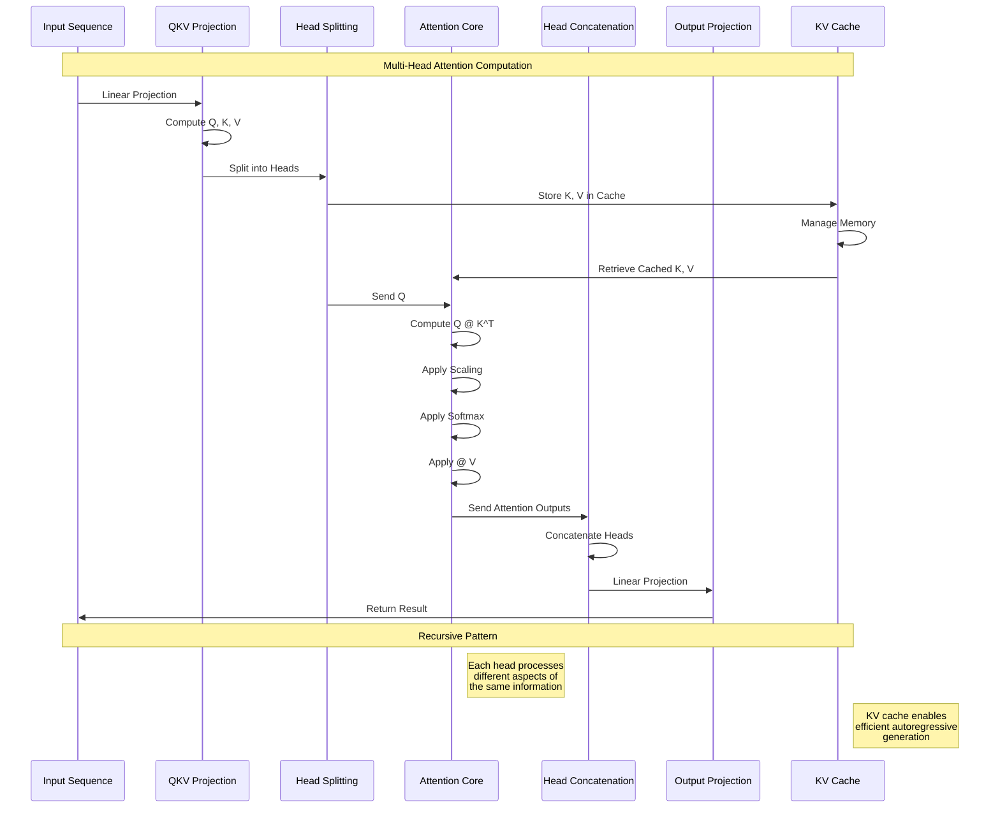
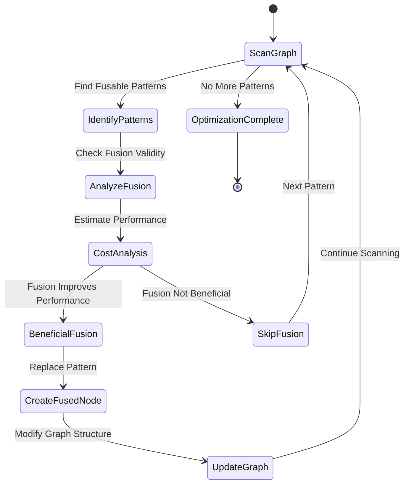
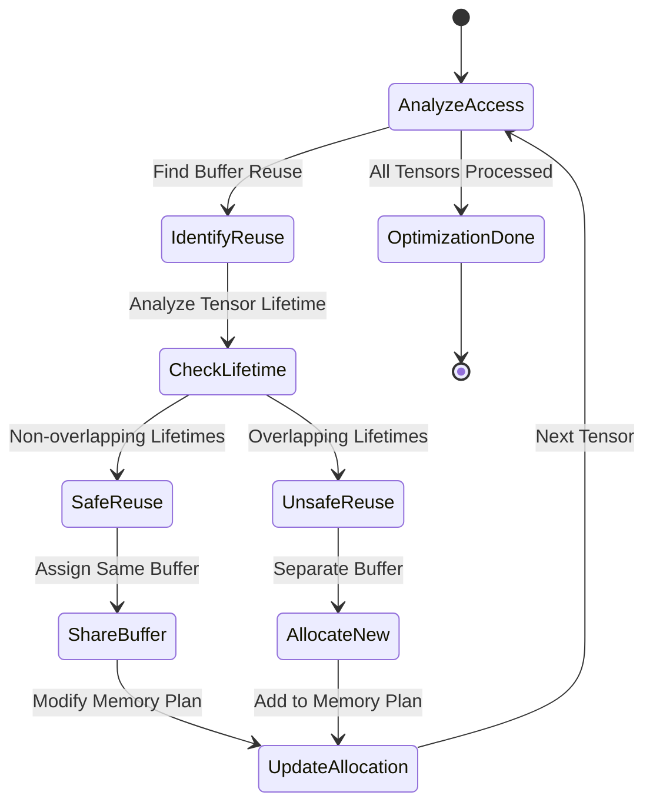

# Compute Graph Architecture and Recursive Execution Patterns

This document explores the **computational graph construction** and **recursive execution patterns** that form the cognitive foundation of KoboldCpp's neural processing capabilities, revealing the **emergent optimization patterns** and **hypergraph-centric** operation scheduling.

## Compute Graph Fundamental Architecture

The compute graph system implements **recursive tensor operation patterns** through a sophisticated directed acyclic graph (DAG) structure:

```mermaid
graph TD
    subgraph "Graph Construction Layer"
        GraphBuilder[Graph Builder<br/>Construction Interface]
        NodeFactory[Node Factory<br/>Operation Creation]
        EdgeManager[Edge Manager<br/>Dependency Tracking]
        Optimizer[Graph Optimizer<br/>Pattern Recognition]
    end
    
    subgraph "Node Type Hierarchy"
        InputNodes[Input Nodes<br/>Data Sources]
        ComputeNodes[Compute Nodes<br/>Operations]
        OutputNodes[Output Nodes<br/>Results]
        ControlNodes[Control Nodes<br/>Flow Management]
    end
    
    subgraph "Operation Categories"
        LinearOps[Linear Operations<br/>MatMul, Conv]
        NonLinearOps[Non-linear Operations<br/>Activations]
        NormOps[Normalization Ops<br/>LayerNorm, RMSNorm]
        AttentionOps[Attention Operations<br/>Self/Cross Attention]
    end
    
    subgraph "Optimization Passes"
        FusionPass[Operation Fusion<br/>Kernel Combination]
        MemoryPass[Memory Optimization<br/>Buffer Sharing]
        SchedulePass[Schedule Optimization<br/>Execution Order]
        BackendPass[Backend Selection<br/>Device Assignment]
    end
    
    %% Construction layer connections
    GraphBuilder --> NodeFactory
    GraphBuilder --> EdgeManager
    GraphBuilder --> Optimizer
    NodeFactory --> EdgeManager
    
    %% Node hierarchy connections
    NodeFactory --> InputNodes
    NodeFactory --> ComputeNodes
    NodeFactory --> OutputNodes
    NodeFactory --> ControlNodes
    
    %% Operation categorization
    ComputeNodes --> LinearOps
    ComputeNodes --> NonLinearOps
    ComputeNodes --> NormOps
    ComputeNodes --> AttentionOps
    
    %% Optimization passes
    Optimizer --> FusionPass
    Optimizer --> MemoryPass
    Optimizer --> SchedulePass
    Optimizer --> BackendPass
    
    classDef construction fill:#e3f2fd,stroke:#01579b,stroke-width:2px
    classDef nodes fill:#f3e5f5,stroke:#4a148c,stroke-width:2px
    classDef operations fill:#e8f5e8,stroke:#1b5e20,stroke-width:2px
    classDef optimization fill:#fff3e0,stroke:#e65100,stroke-width:2px
    
    class GraphBuilder,NodeFactory,EdgeManager,Optimizer construction
    class InputNodes,ComputeNodes,OutputNodes,ControlNodes nodes
    class LinearOps,NonLinearOps,NormOps,AttentionOps operations
    class FusionPass,MemoryPass,SchedulePass,BackendPass optimization
```

## Transformer Layer Compute Graph Pattern

The core transformer computation follows **recursive attention patterns** with emergent cognitive capabilities:

## Graph Execution State Machine

The compute graph execution follows **adaptive scheduling patterns** with emergent optimization:

## Memory Layout and Buffer Management

The graph system implements **recursive memory patterns** for optimal resource utilization:

## Operation Fusion Patterns

The graph optimizer implements **emergent fusion patterns** to reduce memory bandwidth and improve performance:

## Attention Mechanism Compute Graph

The attention computation exhibits **recursive cognitive patterns** through sophisticated graph structures:

## Graph Optimization Algorithms

The system implements **hypergraph pattern encoding** through sophisticated optimization algorithms:

### 1. **Operation Fusion Algorithm**

### 2. **Memory Layout Optimization**

## Neural-Symbolic Integration in Graph Construction

The compute graph architecture facilitates **cognitive synergy optimization** through several integration points:

### 1. **Symbolic Graph Analysis**
- **Dependency Analysis**: Symbolic reasoning about operation dependencies
- **Shape Inference**: Symbolic computation of tensor dimensions
- **Memory Planning**: Symbolic analysis of memory requirements

### 2. **Neural Computation Primitives**
- **Attention Patterns**: Neural attention mechanisms with symbolic structure
- **Activation Functions**: Neural non-linearities with symbolic derivatives
- **Normalization**: Neural statistics with symbolic invariants

### 3. **Emergent Optimization Patterns**
- **Adaptive Fusion**: Dynamic operation combination based on performance
- **Resource Allocation**: Intelligent assignment of computational resources
- **Pattern Recognition**: Automatic identification of optimization opportunities

This **transcendent technical precision** in graph architecture enables KoboldCpp's **emergent cognitive capabilities** through systematic decomposition of complex neural operations into optimizable computational patterns, supporting **distributed cognition** through clear abstraction boundaries and recursive processing structures.