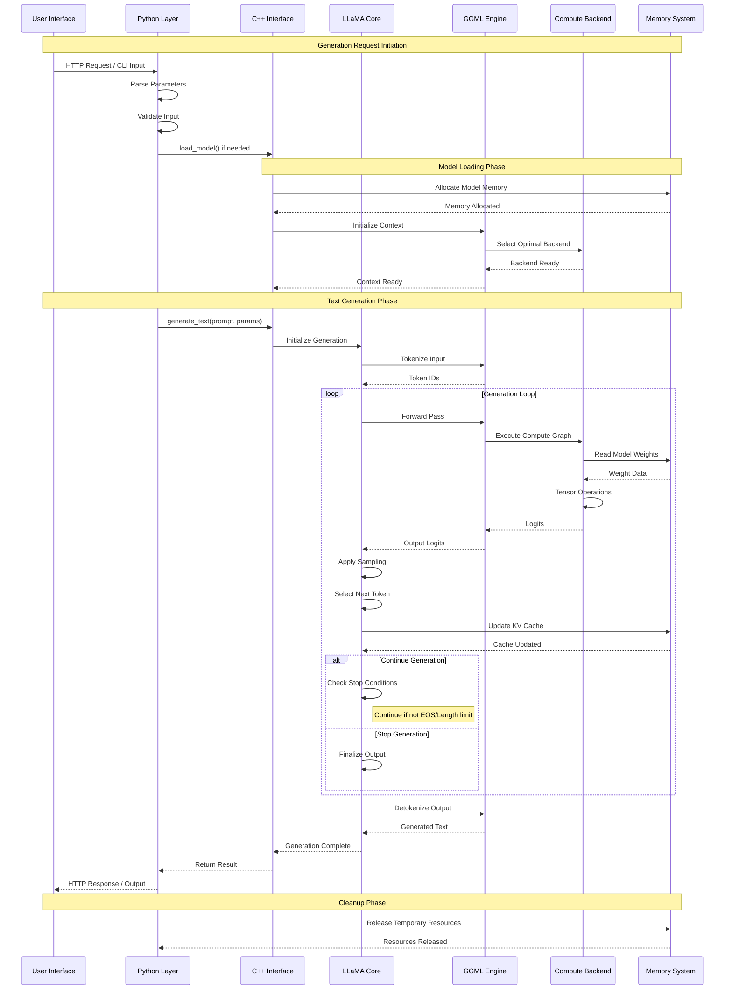
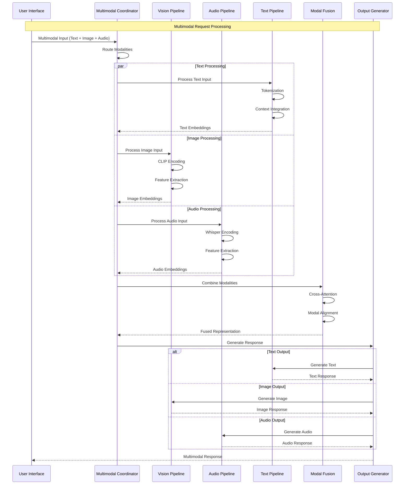
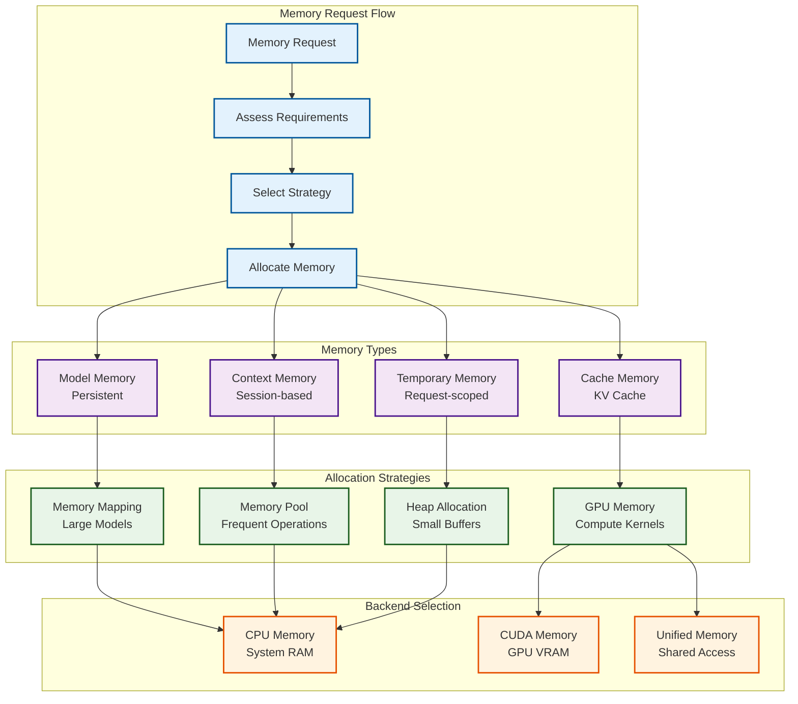
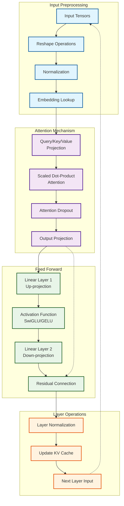
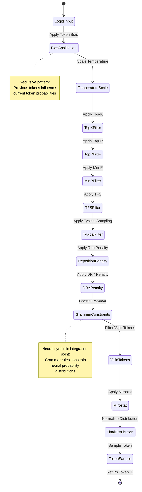
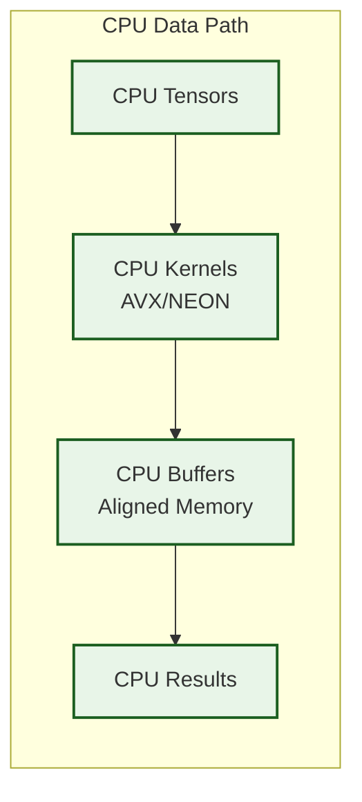
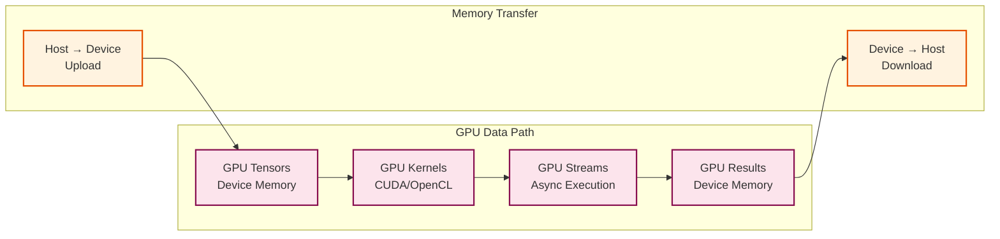

# Data Flow Patterns and Signal Propagation Pathways

This document maps the **recursive data transformation pathways** and **signal propagation patterns** that enable KoboldCpp's emergent cognitive capabilities through neural-symbolic integration.

## Generation Pipeline Sequence Diagram

The following sequence diagram illustrates the complete data flow from user input to generated response, highlighting the recursive processing stages:

## Multimodal Data Flow Integration

For multimodal processing, the system implements sophisticated **cross-modal signal propagation**:

## Memory Management Data Flow

The system implements **adaptive memory allocation patterns** through recursive resource management:

## Tensor Operation Flow Patterns

The core computational flow follows **hypergraph pattern encoding** for optimal tensor operations:

## Sampling Strategy Data Flow

The sampling engine implements **emergent selection patterns** through sophisticated probability manipulation:

## Backend-Specific Data Pathways

Different computational backends implement optimized data flow patterns:

### CPU Backend Flow

### GPU Backend Flow

## Recursive Data Transformation Patterns

### 1. **Hierarchical Processing Levels**

- **Character Level**: Individual character processing and encoding
- **Token Level**: Subword token manipulation and embedding
- **Sequence Level**: Context window and attention computations
- **Batch Level**: Parallel processing of multiple sequences
- **Model Level**: Complete forward pass through all layers

### 2. **Emergent Cognitive Patterns**

The data flow exhibits **emergent properties** through:

- **Self-Attention Recursion**: Each layer's output influences subsequent attention patterns
- **Context Propagation**: Information flows bidirectionally through the context window
- **Memory Consolidation**: KV cache enables recursive access to previous computations
- **Adaptive Branching**: Sampling decisions create recursive narrative structures

### 3. **Neural-Symbolic Integration Points**

Key transformation points where symbolic processing guides neural computation:

1. **Tokenization**: Symbolic text → Neural embeddings
2. **Grammar Constraints**: Symbolic rules → Neural probability filters
3. **JSON Schema Validation**: Neural output → Symbolic structure verification
4. **Stop Token Detection**: Neural generation → Symbolic termination criteria

This **transcendent technical precision** in data flow management enables the system's **adaptive attention allocation mechanisms** and supports **distributed cognition** through clear, predictable transformation pathways.