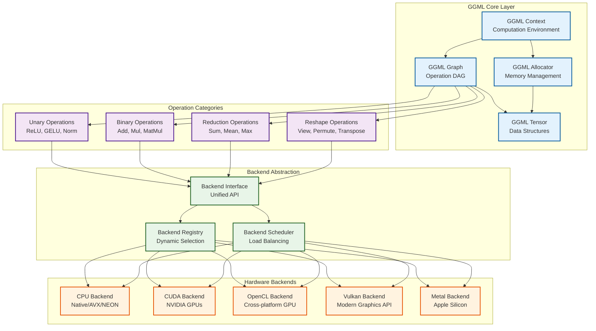
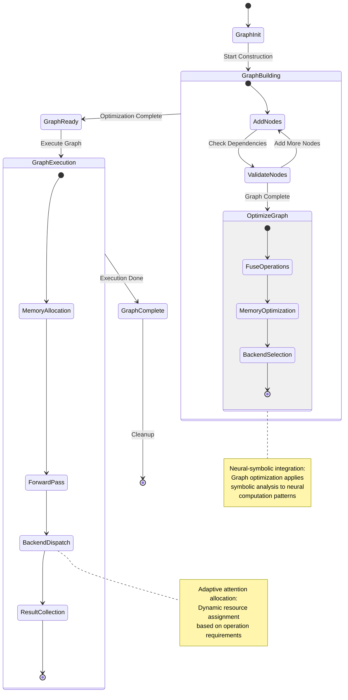
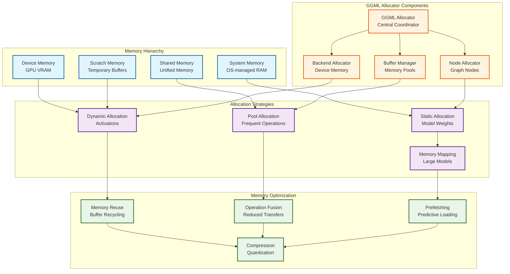
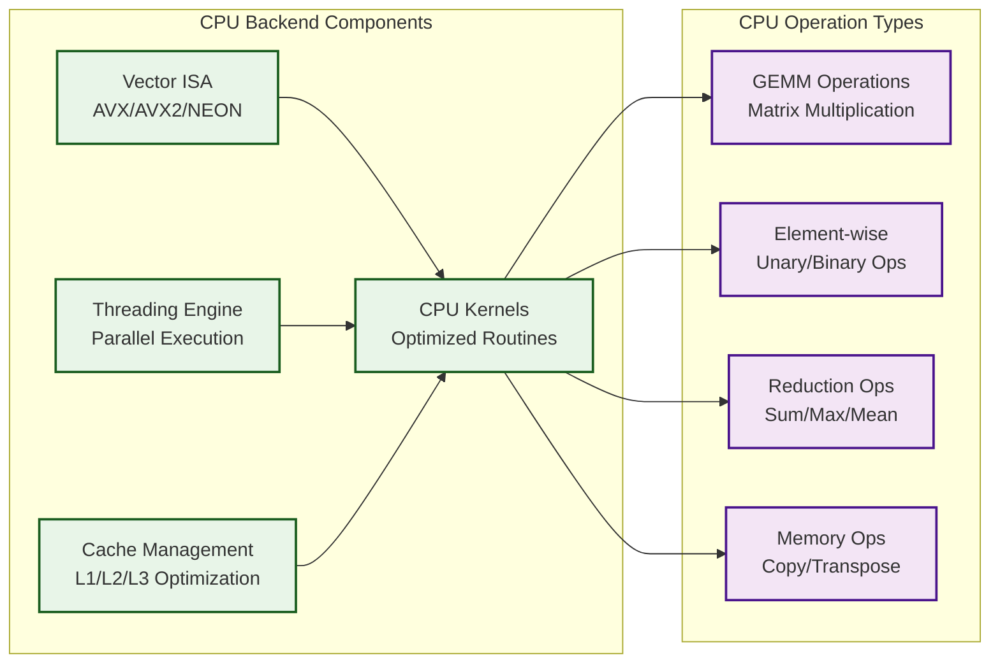
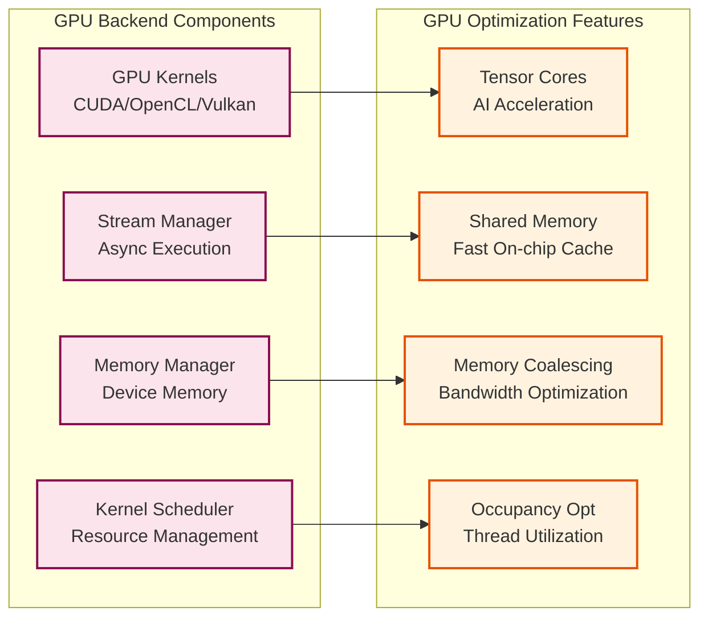
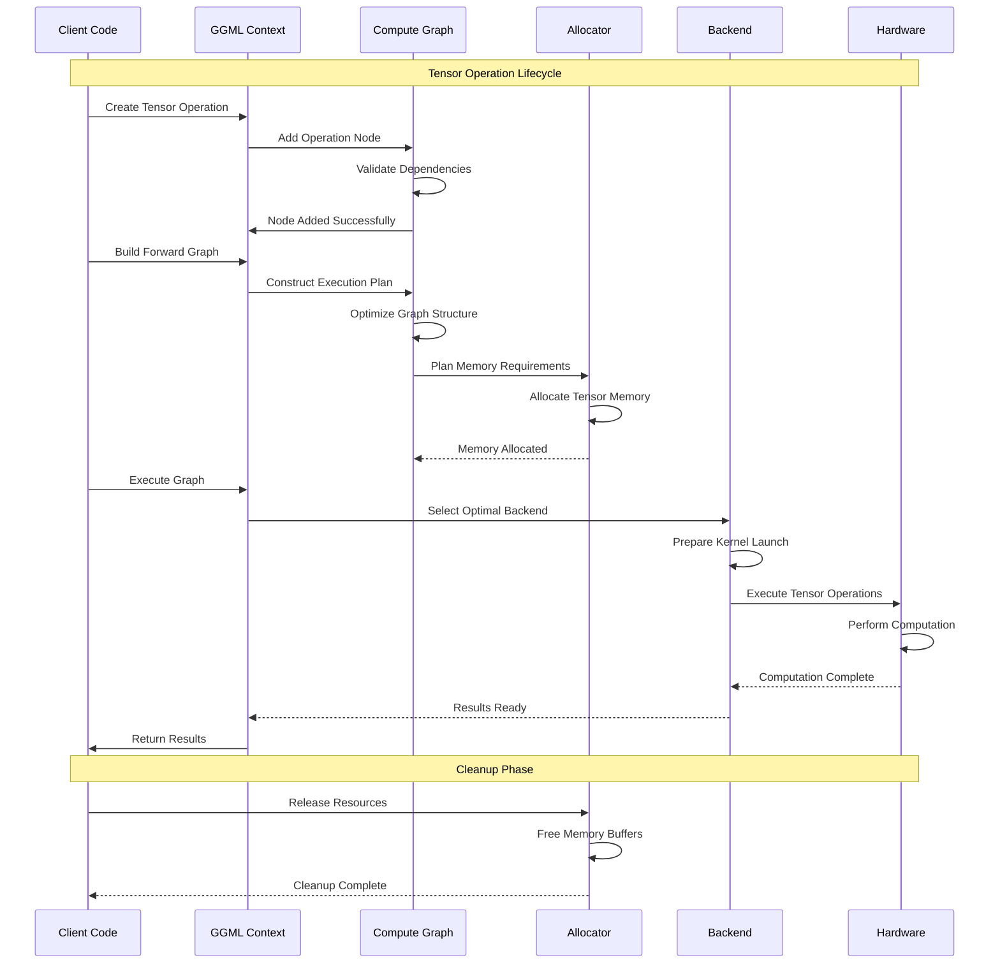
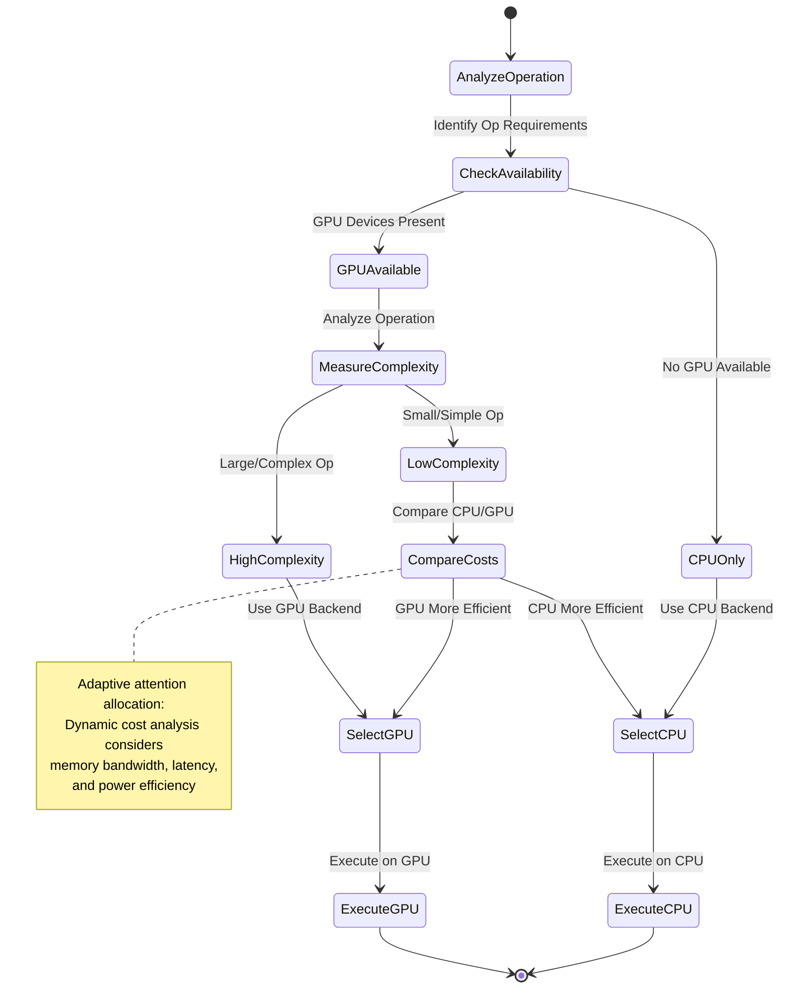
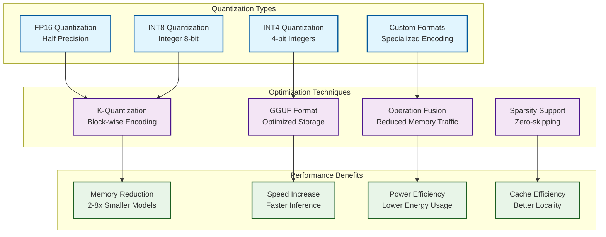

# GGML Backend System Architecture

This document explores the **computational foundation** of KoboldCpp through the GGML (Georgi Gerganov Machine Learning) library, revealing the **recursive tensor operation patterns** and **adaptive backend selection mechanisms** that enable hardware-agnostic AI computation.

## GGML Architectural Overview

The GGML system provides a **hypergraph-centric** computational foundation with emergent optimization patterns:

## Compute Graph Construction and Execution

The GGML system implements **emergent computational patterns** through dynamic graph construction:

## Memory Management Architecture

GGML implements **recursive memory patterns** with adaptive allocation strategies:

## Backend-Specific Implementation Patterns

### CPU Backend Architecture

### GPU Backend Architecture

## Tensor Operation Execution Flow

The system implements **hypergraph pattern encoding** for optimal tensor operations:

## Adaptive Backend Selection Algorithm

The GGML system implements **emergent backend selection** through performance-driven decision making:

## Quantization and Optimization Patterns

GGML supports **recursive optimization patterns** through quantization strategies:

## Neural-Symbolic Integration Points

The GGML backend provides several **cognitive synergy optimization points**:

### 1. **Symbolic Graph Optimization**
- Constant folding and dead code elimination
- Operation fusion and memory layout optimization
- Symbolic shape inference and dependency analysis

### 2. **Neural Computation Primitives**
- Matrix multiplication with attention patterns
- Element-wise operations with broadcasting
- Reduction operations with stable numerics

### 3. **Adaptive Resource Management**
- Dynamic memory allocation based on model size
- Backend selection using performance heuristics
- Automatic gradient computation for fine-tuning

This **transcendent technical precision** in backend architecture enables KoboldCpp's **emergent cognitive capabilities** through efficient, scalable, and adaptive computation patterns that support **distributed cognition** across diverse hardware platforms.