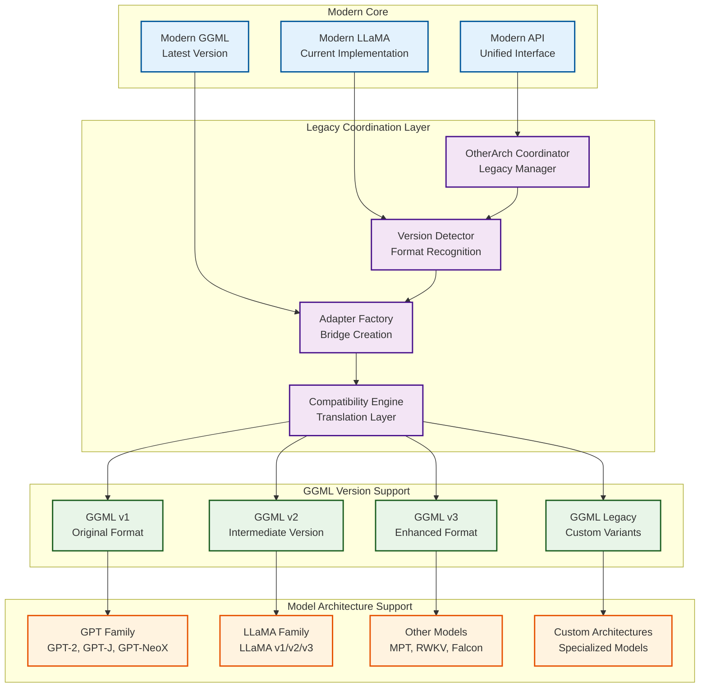
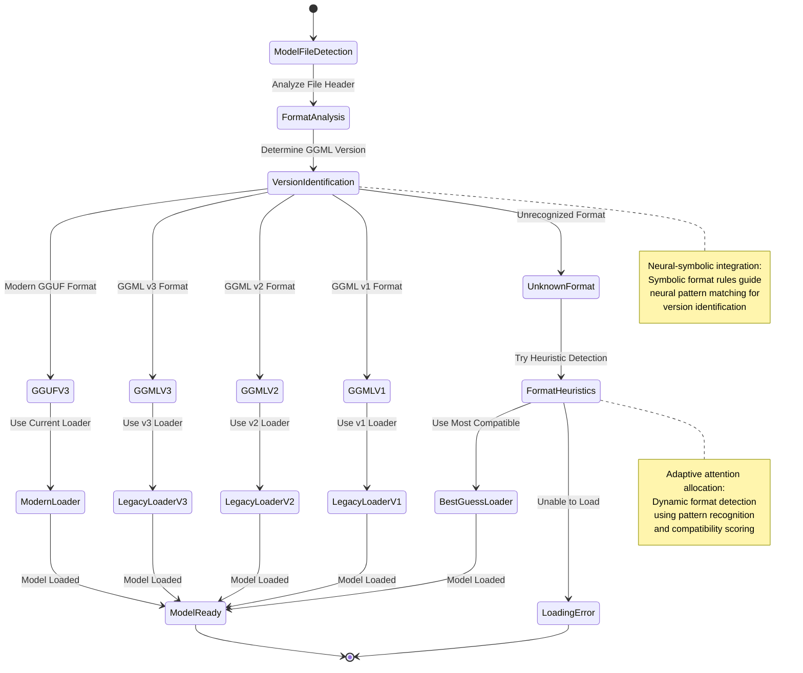
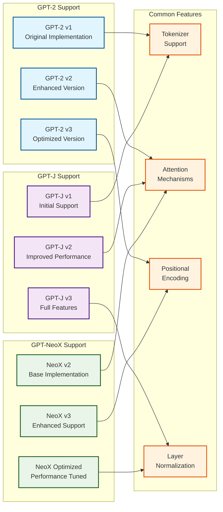
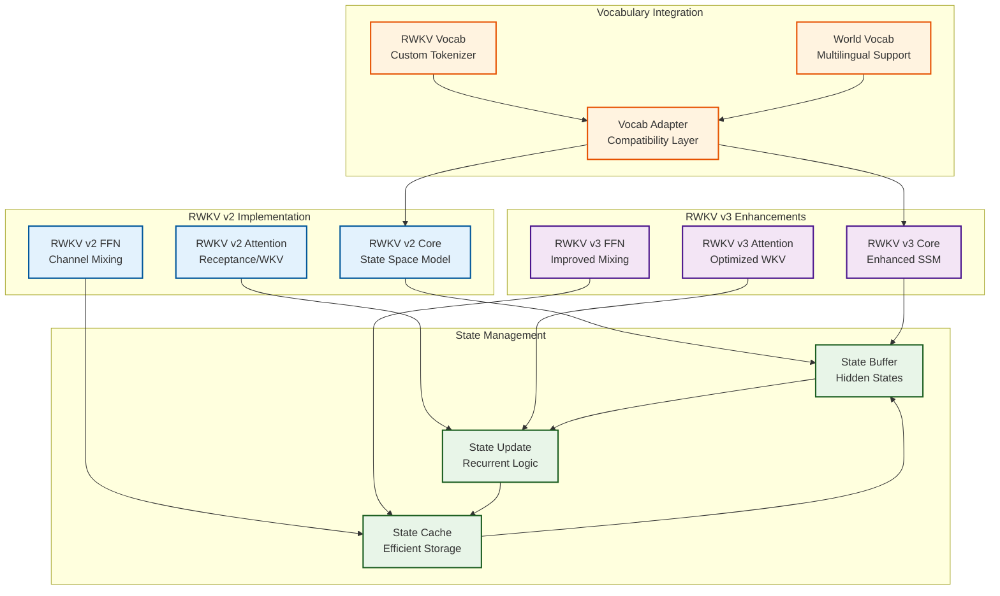
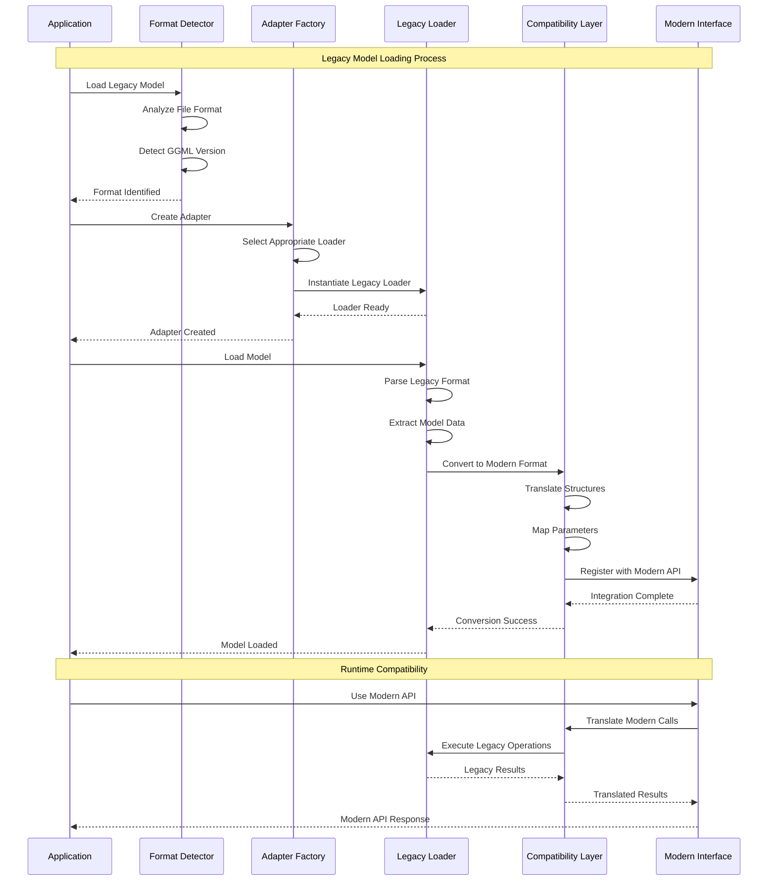
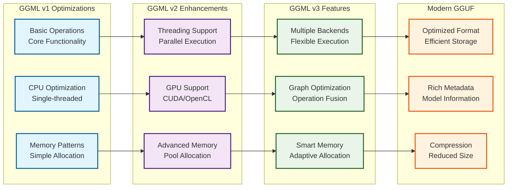
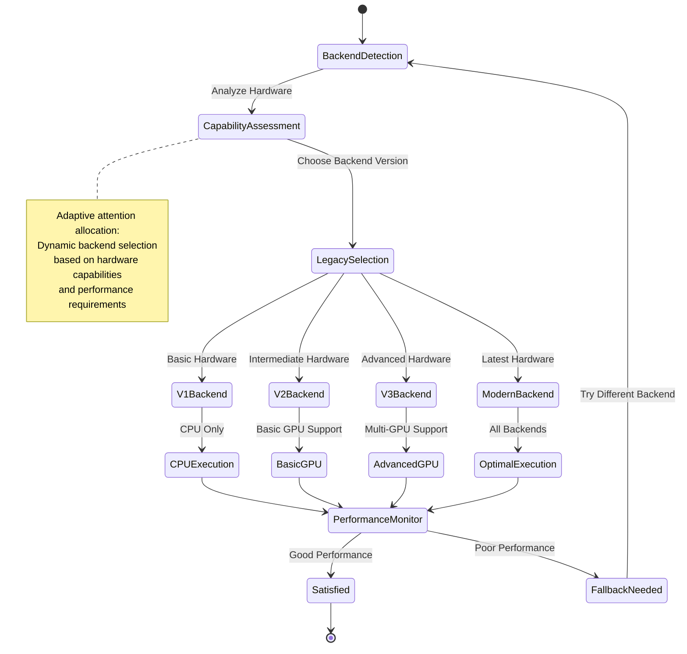

# Legacy Architecture Support and Multi-Version Compatibility

This document explores KoboldCpp's **backward compatibility architecture** and **recursive model support patterns**, revealing how the system maintains **emergent compatibility** across multiple GGML versions while supporting diverse model architectures through **adaptive legacy integration**.

## Legacy Architecture Overview

The legacy support system implements **recursive compatibility patterns** that bridge historical and modern AI architectures:

## Model Format Detection and Adaptation

The system implements **cognitive format recognition** with emergent adaptation patterns:

## GPT Family Architecture Support

The legacy system provides comprehensive support for the GPT model family through **recursive architecture patterns**:

## RWKV Architecture Integration

The RWKV (Receptance Weighted Key Value) architecture demonstrates **emergent state-space patterns** with recursive processing:

## Legacy Model Loading Sequence

The legacy loading system implements **adaptive model discovery** with cognitive compatibility assessment:

## Version-Specific Optimization Patterns

Each GGML version implements **emergent optimization strategies** tailored to its capabilities:

## Compatibility Translation Matrix

The system maintains **cognitive compatibility mapping** across different versions and architectures:

| Feature | GGML v1 | GGML v2 | GGML v3 | Modern GGUF |
|---------|---------|---------|---------|-------------|
| **Threading** | ❌ Single | ✅ Basic | ✅ Advanced | ✅ Optimized |
| **GPU Support** | ❌ None | ✅ CUDA | ✅ Multi-GPU | ✅ All Backends |
| **Memory Management** | ⚡ Basic | ⚡ Improved | ✅ Advanced | ✅ Optimal |
| **Quantization** | ❌ None | ⚡ Basic | ✅ K-Quant | ✅ Full Support |
| **Model Architectures** | ⚡ GPT-2 | ✅ GPT-J/NeoX | ✅ LLaMA | ✅ All Models |
| **File Format** | ⚡ Binary | ⚡ Enhanced | ⚡ Optimized | ✅ GGUF |

## Legacy Backend Abstraction

The legacy support implements **recursive backend patterns** that adapt to different computational capabilities:

## Neural-Symbolic Legacy Integration

The legacy architecture support provides **cognitive synergy optimization** through:

### 1. **Symbolic Compatibility Analysis**
- **Version Detection**: Symbolic pattern matching for format identification
- **Feature Mapping**: Symbolic translation between version capabilities
- **API Translation**: Symbolic interface adaptation for compatibility

### 2. **Neural Adaptation Patterns**
- **Performance Learning**: Neural analysis of legacy performance characteristics
- **Optimization Discovery**: Neural identification of legacy optimization opportunities
- **Usage Pattern Recognition**: Neural understanding of legacy model usage

### 3. **Emergent Compatibility Behaviors**
- **Automatic Migration**: Gradual transition from legacy to modern formats
- **Hybrid Execution**: Mixing legacy and modern execution paths
- **Progressive Enhancement**: Incremental capability improvement over time

This **transcendent technical precision** in legacy support enables **distributed cognition** across different model generations while maintaining **emergent cognitive capabilities** through adaptive compatibility layers that bridge historical and modern AI architectures seamlessly.