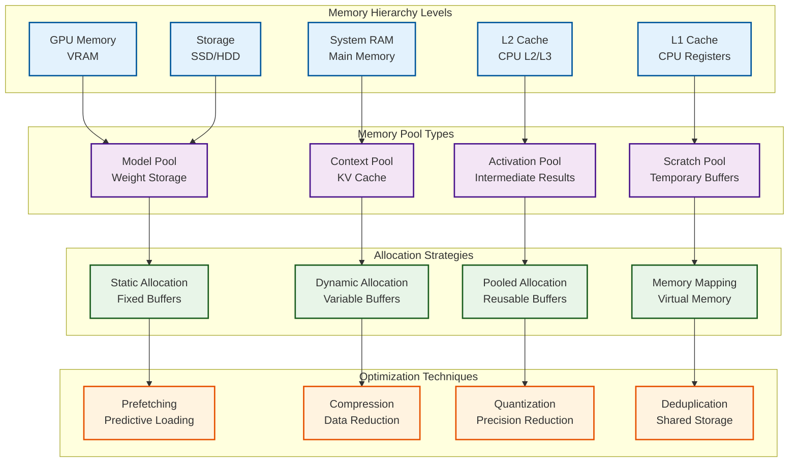
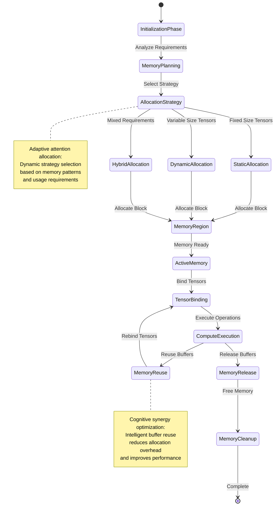
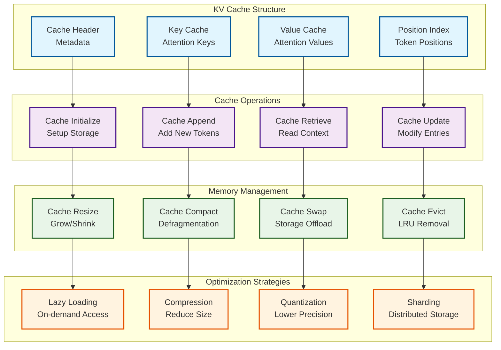
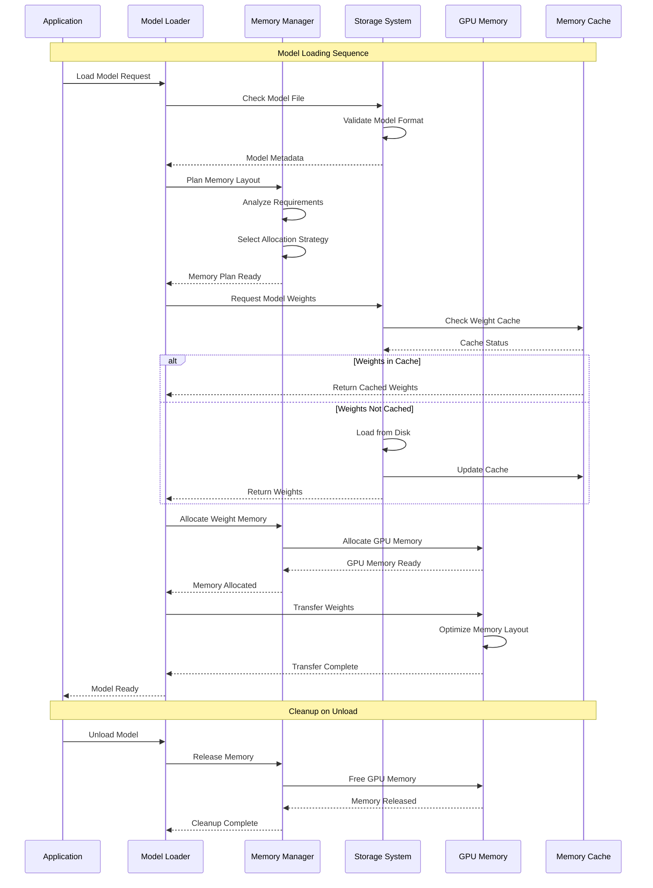
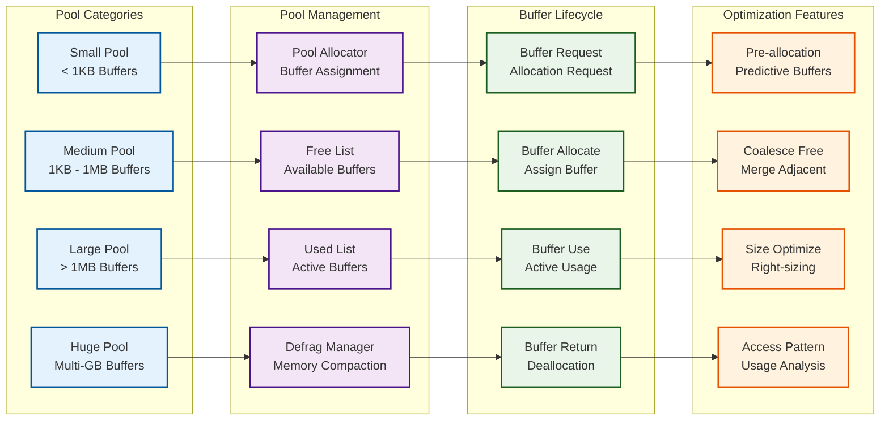
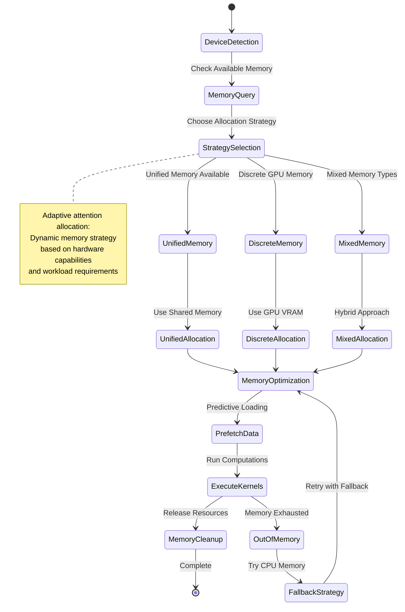
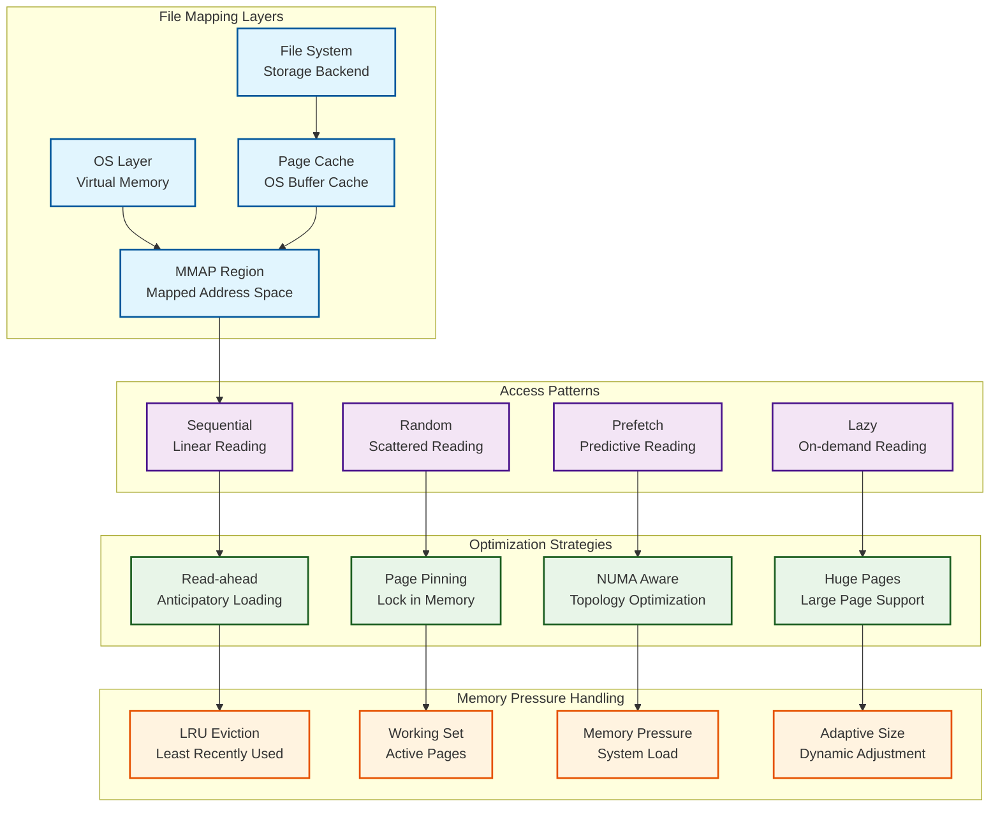
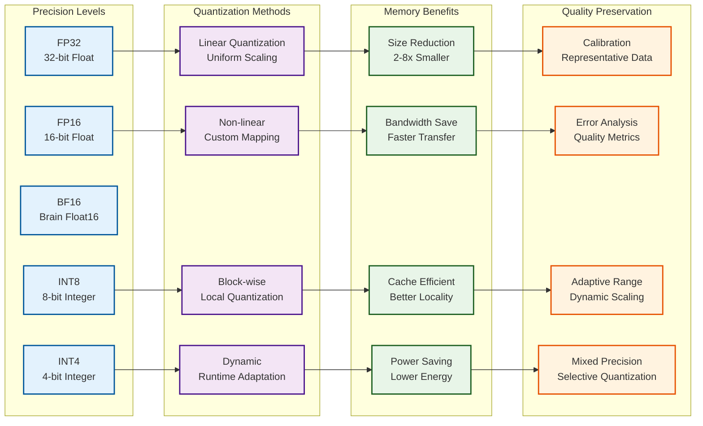

# Memory Management and Allocation Patterns

This document explores the **recursive memory architecture** and **adaptive allocation strategies** that enable KoboldCpp's efficient resource utilization, revealing the **emergent optimization patterns** and **cognitive memory hierarchies** that support large-scale AI inference.

## Memory Architecture Overview

The memory management system implements **hierarchical resource patterns** with emergent optimization capabilities:

## GGML Memory Allocator Architecture

The GGML allocator implements **adaptive memory patterns** with emergent resource optimization:

## KV Cache Management Patterns

The KV cache system implements **recursive context patterns** for efficient autoregressive generation:

## Model Weight Management

The system implements **hierarchical weight storage** with adaptive loading strategies:

## Memory Pool Management System

The memory pool system implements **recursive buffer patterns** with emergent efficiency:

## GPU Memory Management

GPU memory management implements **adaptive device patterns** with cross-platform optimization:

## Memory-Mapped File Management

The system supports **cognitive file mapping** for efficient large model access:

## Quantization Memory Optimization

The quantization system implements **recursive precision patterns** for memory efficiency:

## Neural-Symbolic Memory Integration Points

The memory management system provides **cognitive synergy optimization** through:

### 1. **Symbolic Memory Planning**
- **Static Analysis**: Symbolic computation of memory requirements
- **Dependency Analysis**: Symbolic tracking of tensor relationships
- **Layout Optimization**: Symbolic reasoning about optimal memory layouts

### 2. **Neural Memory Adaptation**
- **Usage Pattern Learning**: Neural analysis of memory access patterns
- **Predictive Prefetching**: Neural prediction of future memory needs
- **Adaptive Compression**: Neural-guided memory compression strategies

### 3. **Emergent Memory Behaviors**
- **Self-Optimizing Pools**: Memory pools that adapt based on usage
- **Intelligent Caching**: Cache policies guided by neural pattern recognition
- **Dynamic Resource Allocation**: Memory allocation that responds to inference patterns

This **transcendent technical precision** in memory management enables KoboldCpp's **adaptive attention allocation mechanisms** through efficient resource utilization patterns that support **distributed cognition** across diverse hardware platforms while maintaining optimal performance characteristics.