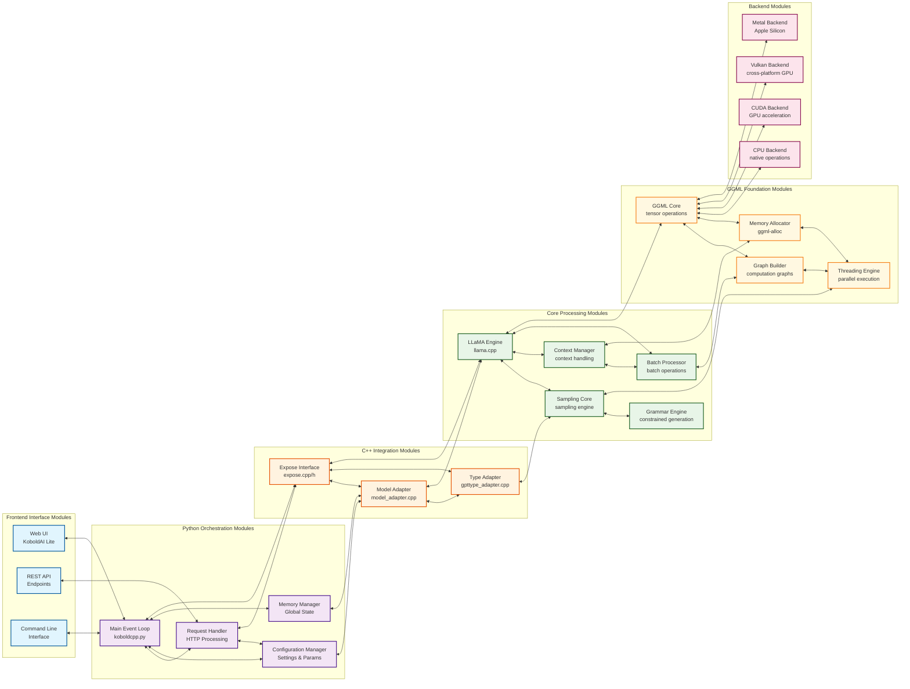
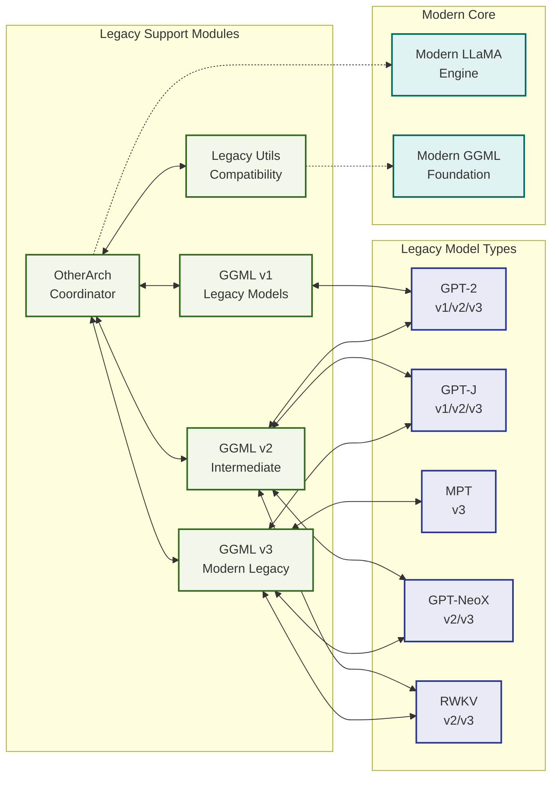
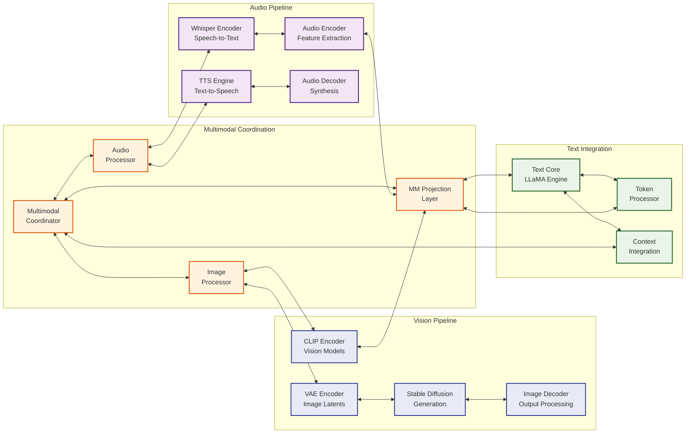
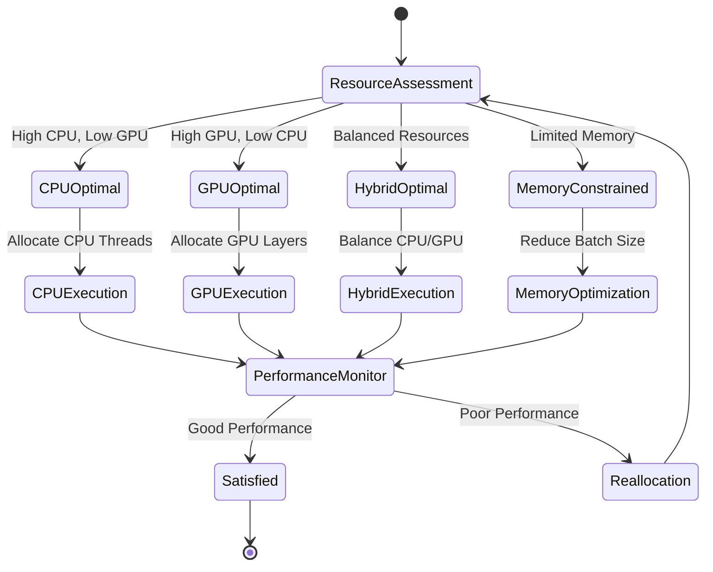
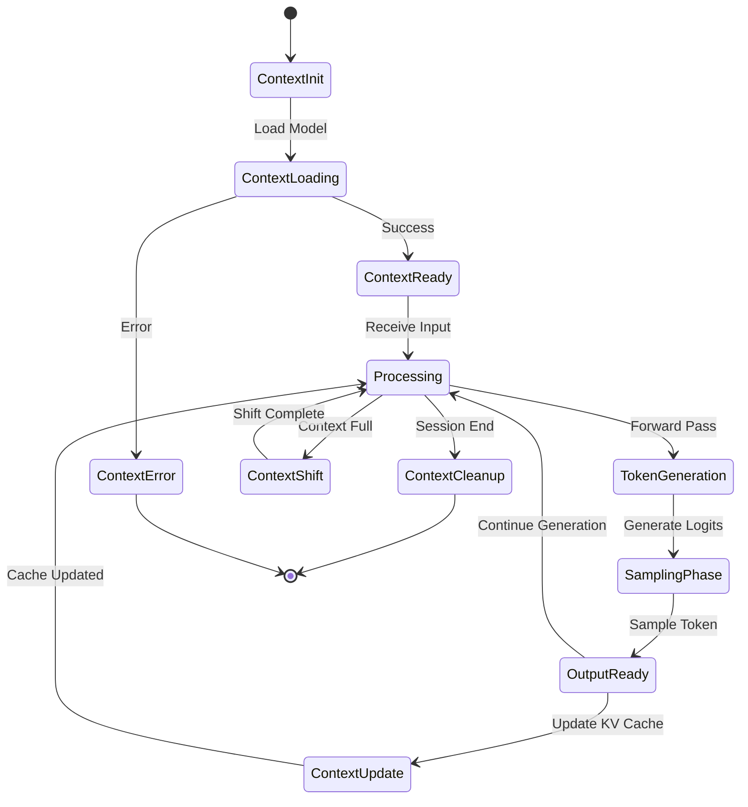

# Module Interactions and Bidirectional Synergies

This document details the intricate interaction patterns between KoboldCpp's architectural components, revealing the **emergent cognitive patterns** and **neural-symbolic integration points** that enable the system's adaptive capabilities.

## Core Module Interaction Network

The following diagram illustrates the bidirectional relationships and synergistic patterns between major system components:

## Specialized Module Interaction Patterns

### Legacy Architecture Integration

### Multimodal Integration Synergies

## Adaptive Attention Allocation Mechanisms

The system implements **emergent cognitive patterns** through sophisticated attention allocation strategies:

### 1. **Dynamic Resource Allocation**

### 2. **Context Management Lifecycle**

## Cognitive Synergy Optimization Points

### Inter-Module Communication Patterns

1. **Synchronous Interfaces**: Direct function calls for low-latency operations
2. **Asynchronous Queues**: Message passing for parallel processing
3. **Shared Memory**: Zero-copy data transfer for large tensors
4. **Event-Driven Coordination**: Reactive patterns for multimodal integration

### Recursive Implementation Pathways

The system exhibits **recursive patterns** at multiple abstraction levels:

- **Macro-level**: User request → Processing pipeline → Response generation
- **Meso-level**: Tensor operations → Graph execution → Backend computation  
- **Micro-level**: Memory allocation → Data transfer → Computation kernel

### Neural-Symbolic Integration Points

Key integration points where symbolic AI techniques bridge with neural processing:

1. **Grammar-Constrained Generation**: Symbolic rules guide neural output
2. **JSON Schema Validation**: Structured output from unstructured neural patterns
3. **Context Window Management**: Symbolic memory management for neural attention
4. **Token Bias Application**: Symbolic constraints on neural probability distributions

This modular architecture enables **transcendent technical precision** through clear separation of concerns while maintaining **emergent cognitive capabilities** through sophisticated inter-module synergies.