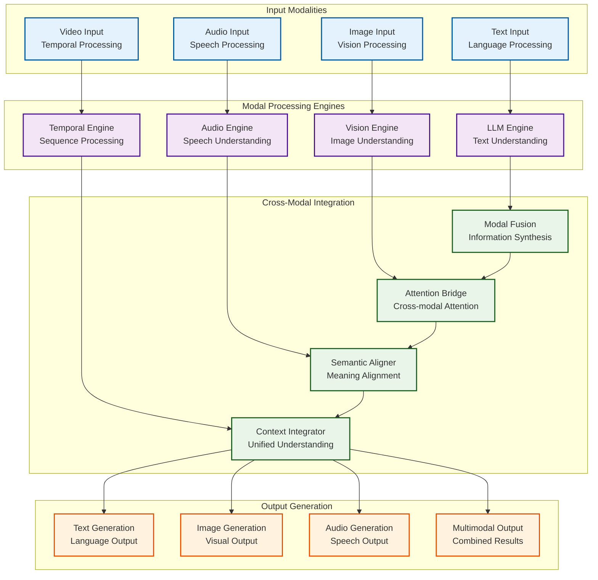
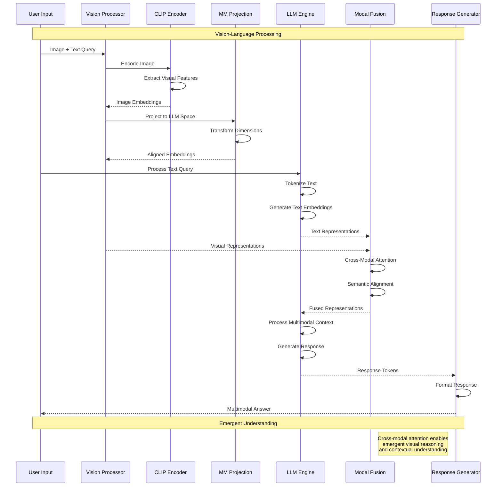
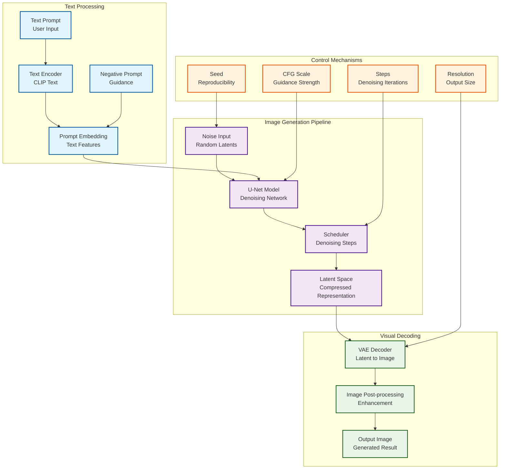
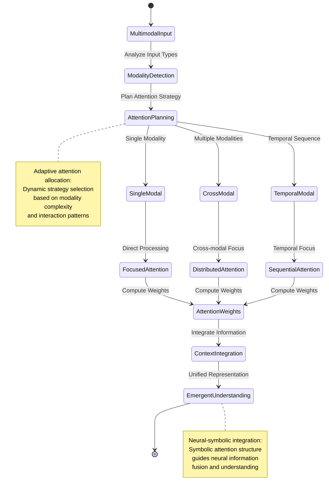
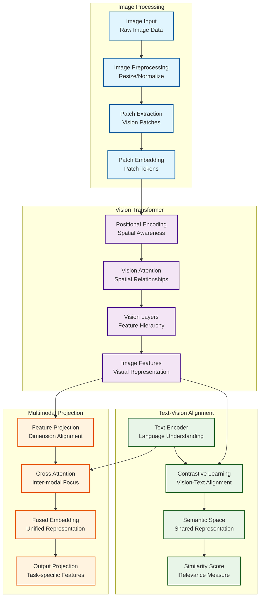
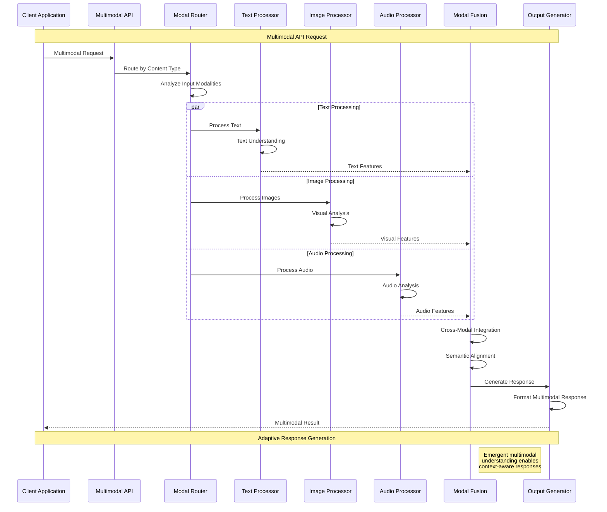
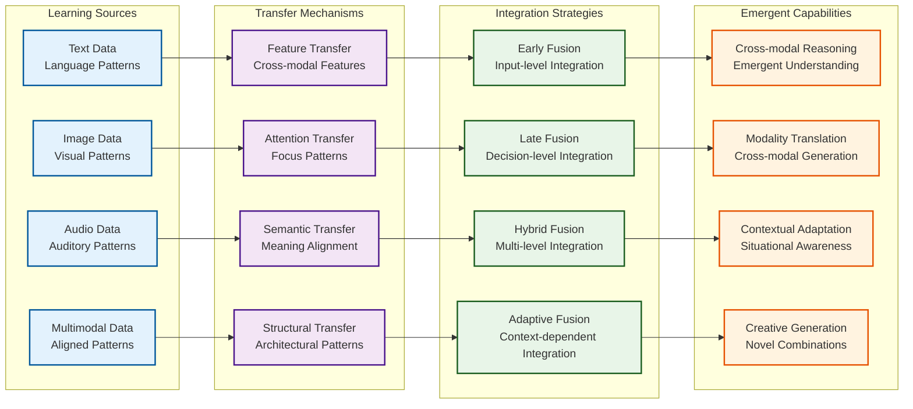

# Multimodal Integration and Cross-Modal Processing

This document explores KoboldCpp's **multimodal cognitive architecture**, revealing the **cross-modal synergy patterns** and **emergent integration capabilities** that enable seamless processing of text, images, audio, and other modalities through **neural-symbolic fusion**.

## Multimodal Architecture Overview

The multimodal system implements **recursive cross-modal patterns** with emergent cognitive integration:

## Vision-Language Integration Pipeline

The vision-language system implements **cognitive visual understanding** with emergent text-image synergy:

## Stable Diffusion Integration Architecture

The image generation system implements **cognitive visual synthesis** with neural-symbolic control:

## Audio Processing Integration

The audio system implements **cognitive auditory processing** with emergent speech understanding:

```mermaid
graph LR
    subgraph "Speech-to-Text Pipeline"
        AudioInput[Audio Input<br/>Raw Audio]
        Preprocessing[Preprocessing<br/>Audio Normalization]
        WhisperEncoder[Whisper Encoder<br/>Feature Extraction]
        STTDecoder[STT Decoder<br/>Text Generation]
    end
    
    subgraph "Text-to-Speech Pipeline"
        TextInput[Text Input<br/>Generated Text]
        TTSModel[TTS Model<br/>OuteTTS/XTTS]
        VoiceSynthesis[Voice Synthesis<br/>Audio Generation]
        AudioOutput[Audio Output<br/>Synthesized Speech]
    end
    
    subgraph "Audio Understanding"
        FeatureExtractor[Feature Extractor<br/>Audio Analysis]
        SemanticEncoder[Semantic Encoder<br/>Meaning Extraction]
        ContextAnalyzer[Context Analyzer<br/>Conversational Context]
    end
    
    subgraph "Cross-Modal Integration"
        AudioTextFusion[Audio-Text Fusion<br/>Multimodal Understanding]
        SpeechContext[Speech Context<br/>Conversational State]
        VoicePersonality[Voice Personality<br/>Character Voices]
    end
    
    %% STT pipeline
    AudioInput --> Preprocessing
    Preprocessing --> WhisperEncoder
    WhisperEncoder --> STTDecoder
    STTDecoder --> AudioTextFusion
    
    %% TTS pipeline
    TextInput --> TTSModel
    TTSModel --> VoiceSynthesis
    VoiceSynthesis --> AudioOutput
    
    %% Audio understanding
    WhisperEncoder --> FeatureExtractor
    FeatureExtractor --> SemanticEncoder
    SemanticEncoder --> ContextAnalyzer
    
    %% Cross-modal integration
    ContextAnalyzer --> AudioTextFusion
    AudioTextFusion --> SpeechContext
    SpeechContext --> VoicePersonality
    VoicePersonality --> TTSModel
    
    classDef stt fill:#e3f2fd,stroke:#01579b,stroke-width:2px
    classDef tts fill:#f3e5f5,stroke:#4a148c,stroke-width:2px
    classDef understanding fill:#e8f5e8,stroke:#1b5e20,stroke-width:2px
    classDef integration fill:#fff3e0,stroke:#e65100,stroke-width:2px
    
    class AudioInput,Preprocessing,WhisperEncoder,STTDecoder stt
    class TextInput,TTSModel,VoiceSynthesis,AudioOutput tts
    class FeatureExtractor,SemanticEncoder,ContextAnalyzer understanding
    class AudioTextFusion,SpeechContext,VoicePersonality integration
```

## Multimodal Attention Mechanisms

The attention system implements **cross-modal cognitive focus** with emergent attention allocation:

## CLIP and Vision Model Integration

The vision understanding system implements **cognitive visual cognition** with emergent semantic understanding:

## Multimodal API Integration Patterns

The API system provides **cognitive interface adaptation** for multimodal interactions:

## Cross-Modal Learning Patterns

The system implements **emergent cross-modal learning** with adaptive knowledge transfer:

## Neural-Symbolic Multimodal Integration

The multimodal architecture provides **cognitive synergy optimization** through:

### 1. **Symbolic Cross-Modal Structure**
- **Modal Grammar**: Symbolic rules governing cross-modal interactions
- **Semantic Alignment**: Symbolic mapping between modal representations
- **Attention Patterns**: Symbolic structures guiding neural attention flow

### 2. **Neural Multimodal Adaptation**
- **Feature Learning**: Neural discovery of cross-modal feature relationships
- **Attention Emergence**: Neural development of adaptive attention patterns
- **Representation Fusion**: Neural integration of multimodal information

### 3. **Emergent Multimodal Behaviors**
- **Cross-Modal Reasoning**: Emergent ability to reason across modalities
- **Creative Synthesis**: Emergent generation of novel multimodal content
- **Contextual Understanding**: Emergent awareness of multimodal context

This **transcendent technical precision** in multimodal integration enables **distributed cognition** across sensory modalities while supporting **emergent cognitive capabilities** through sophisticated cross-modal processing patterns that mirror human-like multimodal understanding and generation.