# KoboldCpp System Overview

This document provides a comprehensive high-level overview of KoboldCpp's architecture, illustrating the principal components and their interconnected relationships through detailed Mermaid diagrams.

## High-Level System Architecture

KoboldCpp implements a **recursive cognitive architecture** that transforms user inputs through multiple processing layers, each providing emergent capabilities through neural-symbolic integration.

```mermaid
graph TD
    subgraph "User Interface Layer"
        UI[Web UI/KoboldAI Lite]
        API[HTTP API Endpoints]
        CLI[Command Line Interface]
    end
    
    subgraph "Python Orchestration Layer"
        PyMain[koboldcpp.py]
        PyAPI[API Handlers]
        PyConfig[Configuration Manager]
        PyMemory[Memory Manager]
    end
    
    subgraph "C++ Integration Layer"
        Expose[expose.cpp/expose.h]
        Adapter[model_adapter.cpp]
        GPTAdapter[gpttype_adapter.cpp]
    end
    
    subgraph "Core Processing Engine"
        LlamaCore[LLaMA Core Engine]
        Sampling[Sampling Engine]
        Context[Context Manager]
        Batch[Batch Processor]
    end
    
    subgraph "GGML Computational Foundation"
        GGML[GGML Library]
        Graph[Compute Graph]
        Tensor[Tensor Operations]
        Memory[Memory Allocator]
    end
    
    subgraph "Backend Abstraction Layer"
        CPU[CPU Backend]
        CUDA[CUDA Backend]
        OpenCL[OpenCL Backend]
        Vulkan[Vulkan Backend]
        Metal[Metal Backend]
    end
    
    subgraph "Legacy Architecture Support"
        OtherArch[otherarch/]
        GGMLV1[GGML v1]
        GGMLV2[GGML v2] 
        GGMLV3[GGML v3]
    end
    
    subgraph "Multimodal Extensions"
        SD[Stable Diffusion]
        Whisper[Whisper STT]
        TTS[Text-to-Speech]
        CLIP[Vision Models]
    end
    
    subgraph "Model Storage"
        GGUF[GGUF Models]
        GGML[GGML Models]
        Weights[Model Weights]
        Config[Model Config]
    end
    
    %% User Interface Connections
    UI --> PyMain
    API --> PyAPI
    CLI --> PyMain
    
    %% Python Layer Connections
    PyMain --> Expose
    PyAPI --> Expose
    PyConfig --> Adapter
    PyMemory --> Context
    
    %% Integration Layer Connections
    Expose --> LlamaCore
    Adapter --> LlamaCore
    GPTAdapter --> OtherArch
    
    %% Core Processing Connections
    LlamaCore --> GGML
    Sampling --> LlamaCore
    Context --> Memory
    Batch --> Graph
    
    %% GGML Foundation Connections
    GGML --> CPU
    GGML --> CUDA
    GGML --> OpenCL
    GGML --> Vulkan
    GGML --> Metal
    Graph --> Tensor
    
    %% Legacy Support Connections
    OtherArch --> GGMLV1
    OtherArch --> GGMLV2
    OtherArch --> GGMLV3
    
    %% Multimodal Connections
    SD --> GGML
    Whisper --> GGML
    TTS --> GGML
    CLIP --> GGML
    
    %% Model Storage Connections
    GGUF --> LlamaCore
    GGML --> OtherArch
    Weights --> Memory
    Config --> PyConfig
    
    %% Styling
    classDef userInterface fill:#e1f5fe
    classDef pythonLayer fill:#f3e5f5
    classDef cppLayer fill:#fff3e0
    classDef coreEngine fill:#e8f5e8
    classDef ggmlFoundation fill:#fff8e1
    classDef backends fill:#fce4ec
    classDef legacy fill:#f1f8e9
    classDef multimodal fill:#e0f2f1
    classDef storage fill:#fafafa
    
    class UI,API,CLI userInterface
    class PyMain,PyAPI,PyConfig,PyMemory pythonLayer
    class Expose,Adapter,GPTAdapter cppLayer
    class LlamaCore,Sampling,Context,Batch coreEngine
    class GGML,Graph,Tensor,Memory ggmlFoundation
    class CPU,CUDA,OpenCL,Vulkan,Metal backends
    class OtherArch,GGMLV1,GGMLV2,GGMLV3 legacy
    class SD,Whisper,TTS,CLIP multimodal
    class GGUF,GGML,Weights,Config storage
```



## Principal Data Flow Pathways

The system implements **emergent cognitive patterns** through hierarchical data transformation:

```mermaid
graph TD
    subgraph "Input Processing"
        Input[User Input]
        Tokenize[Tokenization]
        Context[Context Integration]
    end
    
    subgraph "Cognitive Processing Core"
        Attention[Attention Mechanism]
        Transform[Transformer Layers]
        Generate[Token Generation]
    end
    
    subgraph "Output Synthesis"
        Sample[Sampling Strategy]
        Detokenize[Detokenization]
        Format[Response Formatting]
    end
    
    subgraph "Memory Systems"
        KVCache[KV Cache]
        WorkingMem[Working Memory]
        LongTerm[Long-term Context]
    end
    
    Input --> Tokenize
    Tokenize --> Context
    Context --> Attention
    
    Attention --> Transform
    Transform --> Generate
    Generate --> Sample
    
    Sample --> Detokenize
    Detokenize --> Format
    
    Context -.-> KVCache
    Attention -.-> WorkingMem
    Transform -.-> LongTerm
    
    KVCache -.-> Attention
    WorkingMem -.-> Transform
    LongTerm -.-> Context
    
    classDef input fill:#e3f2fd
    classDef processing fill:#f3e5f5
    classDef output fill:#e8f5e8
    classDef memory fill:#fff3e0
    
    class Input,Tokenize,Context input
    class Attention,Transform,Generate processing  
    class Sample,Detokenize,Format output
    class KVCache,WorkingMem,LongTerm memory
```

## Recursive Implementation Pathways

### 1. **Adaptive Context Allocation**
The system dynamically allocates computational resources based on model requirements and available hardware, implementing recursive optimization patterns that emerge from the interaction between the Python orchestration layer and GGML computational foundation.

### 2. **Multi-Backend Abstraction**
Hardware abstraction is achieved through recursive delegation patterns, where high-level operations are decomposed into backend-specific implementations while maintaining unified interfaces.

### 3. **Hierarchical Memory Management**
Memory allocation follows recursive patterns where:
- **Local scope**: Individual tensor operations
- **Function scope**: Computational graph execution
- **Session scope**: Model context and KV cache
- **Global scope**: Model weights and persistent state

### 4. **Emergent Cognitive Synergies**

The architecture exhibits emergent properties through:

- **Cross-modal Integration**: Seamless processing of text, image, and audio through unified tensor operations
- **Adaptive Attention Allocation**: Dynamic focus mechanisms that optimize computational resources
- **Recursive Pattern Recognition**: Self-similar processing structures at multiple abstraction levels
- **Neural-Symbolic Integration**: Bridge between symbolic AI techniques and neural network processing

## System Capabilities Matrix

| Component | Text Generation | Image Generation | Speech Processing | Multimodal |
|-----------|----------------|------------------|-------------------|------------|
| **Core Engine** | ✅ Primary | ➖ No | ➖ No | ✅ Coordination |
| **Stable Diffusion** | ➖ No | ✅ Primary | ➖ No | ✅ Image |
| **Whisper** | ➖ No | ➖ No | ✅ STT | ✅ Audio Input |
| **TTS Engine** | ➖ No | ➖ No | ✅ Speech Output | ✅ Audio Output |
| **CLIP/Vision** | ➖ No | ✅ Conditioning | ➖ No | ✅ Vision |

## Performance Characteristics

The system's **transcendent technical precision** emerges from:

1. **Zero-Copy Operations**: Minimized memory transfers through shared tensor buffers
2. **Asynchronous Processing**: Non-blocking operations for improved throughput
3. **Dynamic Batching**: Adaptive batch size optimization based on available resources
4. **Memory-Mapped Models**: Efficient model loading without full memory copying
5. **Backend-Specific Optimizations**: Tailored operations for each computational backend

This architecture enables **distributed cognition** by providing clear separation of concerns while maintaining tight integration through well-defined interfaces and recursive processing patterns.